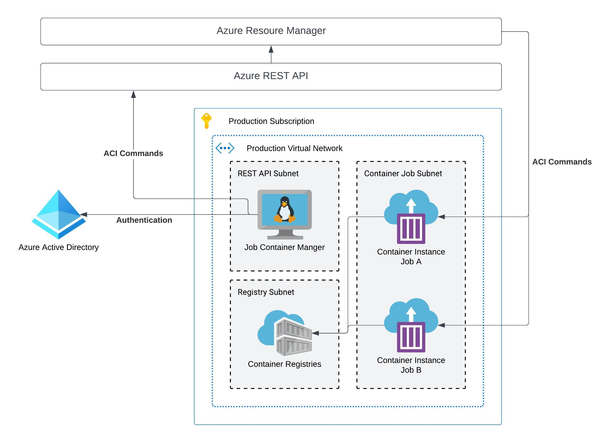

# **Job Container Manager Architecture**

## **Virtual Network Deployment**

Below is an example of deploying the job container manager inside of a virtual network.

---

## **Requirements**

Please review the following requiremnts to properly deploy the architecture into a virutal network environment.

### **Virutal Network**

When deploying the a job container architecture inside a virtual networking,
you should do the following.

1. Create a dedicated subnet for the container groups
    - Delegate the subnet to the `Microsoft.ContainerInstance/containerGroups` service
        - Required to deploy container groups to a virtual network subnet
2. Review you network address allocation
    - Make sure you have an appropriate amount of address spaces availiable
    for potential jobs being created
    - 1 container group will consume 1 IP address space

### **Service Principal**

### **User Assigned Managed Identity**